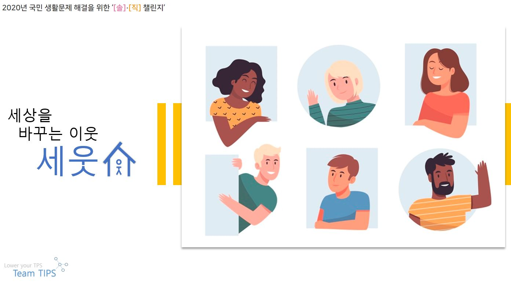
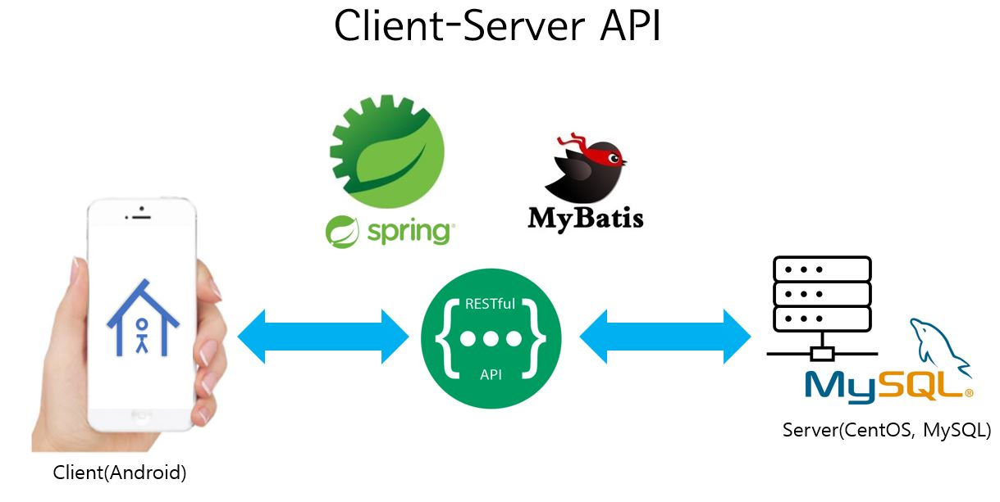

## 세상을 바꾸는 이웃, 세웃

세웃(Saeut)은 빠르고 간편하게 적은 비용으로 꼭 필요한 돌봄을 제공하는 이웃 기반 모바일 플랫폼입니다.

[소개 동영상 바로가기](https://ictchallenge.meet.or.kr/video/AD0814184.mp4)

## RESTful API with Spring framework

본 저장소의 API는 클라이언트-서버 간 원활한 연동을 위해 Spring Framework로 개발된 RESTful API입니다. MyBatis를 통한 MySQL DB 연동을 통해 CRUD를 비롯한 다양한 데이터 연동 기능을 구현하였습니다.

